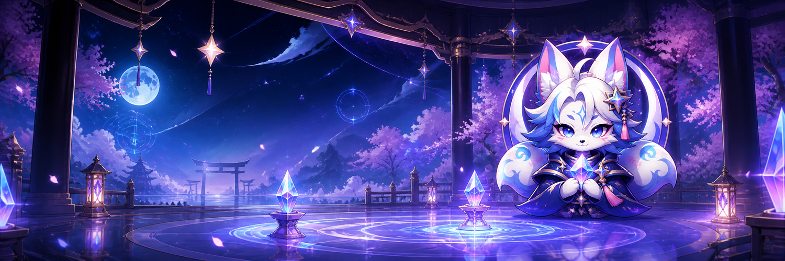
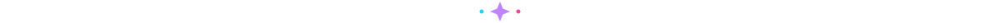
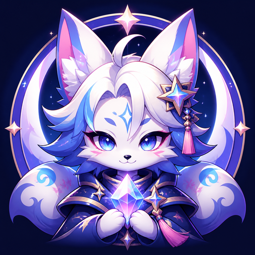

  

<h1 align="center">✦ Kacks ✦</h1>

  <strong>Criando pontes entre gachas e jogadores brasileiros.</strong> 
  Mods, traduções PT-BR, ferramentas e guias — gratuitos, abertos e feitos com cuidado.

  
  
  
  

  Community-made Brazilian Portuguese localizations and tools for gacha games.

## 🌙 Sobre mim

Eu transformo meu carinho por **gachas, anime e jogos asiáticos** em projetos que ajudam mais pessoas a aproveitar histórias que antes estavam presas atrás da barreira do idioma.

- 🎮 **Foco:** gachas e jogos com estética anime.
- 💬 **Missão:** tornar histórias acessíveis em português brasileiro sem apagar o tom original.
- 🧩 **Método:** tradução contextual, revisão editorial, automação, auditoria e testes reais.
- 💜 **Compromisso:** projetos comunitários gratuitos, sem paywall e sem monetização.

## ✨ Projeto em destaque

<table>
  <tr>
    <td width="132" align="center">
      
    </td>
    <td>
      <strong>Brown Dust 2 PT-BR</strong> 
      Tradução comunitária integral de Brown Dust 2 para português brasileiro.  
      <code>v0.9.0</code> em validação privada · <strong>223.731</strong> entradas efetivas · <strong>293</strong> títulos musicais preservados. 
      O lançamento público acontecerá somente quando a experiência estiver pronta para a comunidade.
    </td>
  </tr>
</table>

## 🪄 O que você encontrará por aqui

| Universo | O que eu preparo |
| --- | --- |
| 🌐 **Localização PT-BR** | Traduções contextuais que respeitam história, personagens e identidade da obra. |
| 🛠️ **Mods e ferramentas** | Instalação simples, validações reproduzíveis e manutenção responsável. |
| 📖 **Guias claros** | Documentação direta para quem só quer baixar, instalar e jogar. |
| 🔭 **Próximos mundos** | Novos gachas e projetos para aproximar jogos asiáticos da comunidade brasileira. |

## 🧰 Ferramentas do laboratório

  
  
  
  
  
  

## 💎 Princípios

> **Acessibilidade antes de tudo.** Mais jogadores entendendo a história é bom para a comunidade e para o próprio jogo.

> **Contexto importa.** Traduzir não é trocar palavras: é preservar intenção, personalidade e emoção.

> **Livre de verdade.** O trabalho é feito para ser compartilhado gratuitamente e aprimorado com transparência.

> **Respeito à obra.** Nomes próprios, músicas e elementos de identidade permanecem no original quando essa é a melhor escolha.

  <strong>✨ Um pull de cada vez, uma barreira a menos. ✨</strong> 
  Feito no Brasil para quem ama jogar e acompanhar cada história.

