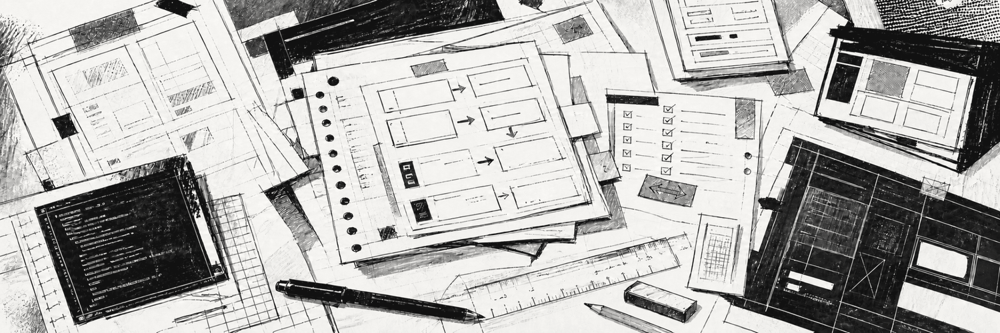
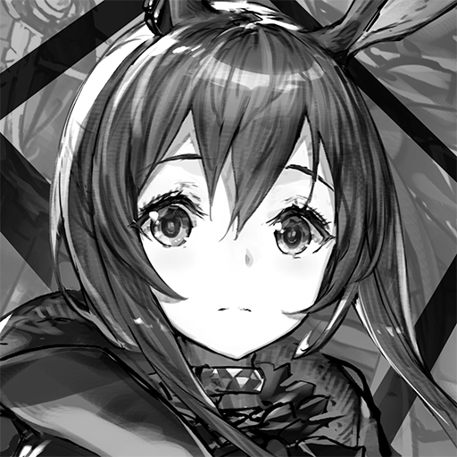

<picture>
  <source media="(prefers-color-scheme: dark)" srcset="./assets/kacks-workbench-dark.png" />
  <source media="(prefers-color-scheme: light)" srcset="./assets/kacks-workbench-light.png" />
  
</picture>

<h1 align="center">KACKS / PROJECTS</h1>

  <strong>TRADUÇÃO DE JOGOS / ENGENHARIA DE MODS / CONTROLE DE QUALIDADE</strong>

  Mods comunitários em português brasileiro, gratuitos, documentados e testados dentro de cada jogo.

  <code>PT-BR</code>&nbsp;&nbsp;
  <code>GACHA</code>&nbsp;&nbsp;
  <code>MODDING</code>&nbsp;&nbsp;
  <code>GRATUITO</code>&nbsp;&nbsp;
  <code>COMUNIDADE</code>

<picture>
  <source media="(prefers-color-scheme: dark)" srcset="./assets/ink-rule-dark.svg" />
  <source media="(prefers-color-scheme: light)" srcset="./assets/ink-rule-light.svg" />
  
</picture>

## 01 / PROJETOS

<table>
  <tr>
    <td width="240" align="center">
      <picture>
        <source media="(prefers-color-scheme: dark)" srcset="./assets/bd2-icon-dark.jpg" />
        <source media="(prefers-color-scheme: light)" srcset="./assets/bd2-icon-light.jpg" />
        
      </picture>
    </td>
    <td>
      <strong><a href="https://github.com/kacksdev/browndust2-ptbr">BROWN DUST 2 PT-BR / PC</a></strong> 
      <code>v0.1.1 beta</code>&nbsp;&nbsp;<code>CLIENTE 2.32.10</code>  
      <strong>223.743</strong> entradas efetivas, <strong>24.873</strong> com tratamento editorial explícito, <strong>293</strong> títulos musicais preservados e zero falha estrutural detectada. Instalador gráfico único validado em cliente limpo, com detecção automática e manual, progresso, verificação, reparo, atualização, remoção e rollback.  
      <a href="https://github.com/kacksdev/browndust2-ptbr"><strong>VER O PROJETO →</strong></a>
    </td>
  </tr>
</table>

<table>
  <tr>
    <td width="145" align="center">
      <picture>
        <source media="(prefers-color-scheme: dark)" srcset="./assets/arknights-icon-dark.png" />
        <source media="(prefers-color-scheme: light)" srcset="./assets/arknights-icon-light.png" />
        
      </picture>
    </td>
    <td>
      <strong><a href="https://github.com/kacksdev/arknights-ptbr">ARKNIGHTS PT-BR / PC + ANDROID</a></strong> 
      <code>v0.0.1-dev</code>  
      Projeto em preparação. A implementação começará no PC para confirmar formatos, atualização e reversibilidade; a adaptação para Android virá depois. Nenhum catálogo foi extraído e nenhuma tradução foi produzida ainda.  
      <a href="https://github.com/kacksdev/arknights-ptbr"><strong>ACOMPANHAR A PREPARAÇÃO →</strong></a>
    </td>
  </tr>
</table>

> Cada cartão informa o estado real do respectivo projeto. Builds disponíveis são publicadas exclusivamente em Releases. O botão `Code → Download ZIP` baixa o conteúdo do repositório e não substitui o arquivo indicado em uma Release.

## 02 / TRADUÇÃO E REVISÃO

Meus projetos têm como primeira meta a **tradução integral dos textos acessíveis pelo mod**. Cobertura traduzida e revisão manual são métricas diferentes: partes de um catálogo podem estar em português e ainda conter literalidade, escolhas contextuais imperfeitas ou inconsistências que serão corrigidas gradualmente.

Por isso, os projetos são apresentados como **traduções comunitárias**, não como localizações profissionais concluídas. Uma versão `1.0.0` fica reservada para o momento em que cobertura, revisão manual, contexto, terminologia, formatação e validação dentro do jogo estejam completos. Esse trabalho editorial avança sem prazo prometido.

## 03 / PROCESSO

  <code>INVENTARIAR</code> →
  <code>EXTRAIR</code> →
  <code>CATALOGAR</code> →
  <code>TRADUZIR</code> →
  <code>AUDITAR</code> →
  <code>TESTAR</code> →
  <code>EMPACOTAR</code>

Cada jogo recebe arquitetura, ferramentas e validações próprias. O objetivo comum é preservar IDs, placeholders, marcações, quebras funcionais, nomes próprios e elementos de identidade da obra, além de manter instalação, atualização e remoção reproduzíveis.

Uma versão desconhecida do cliente não deve receber arquivos antigos às cegas. Sempre que tecnicamente possível, o mod deve reconhecer incompatibilidades e falhar de forma segura, mantendo o jogo original funcional. Conteúdo novo sem tradução pode existir até o catálogo ser atualizado; quebrar ou bloquear o cliente não é um comportamento aceitável.

## 04 / FERRAMENTAS

<strong>DESENVOLVIMENTO E AUTOMAÇÃO</strong> 
<code>C</code> <code>C#</code> <code>.NET</code> <code>.NET Framework</code> <code>WPF</code> <code>Python</code> <code>PowerShell</code> <code>Git</code>

<strong>JOGOS, DADOS E MODDING</strong> 
<code>Unity</code> <code>IL2CPP</code> <code>Win32 / WinHTTP</code> <code>MinHook</code> <code>BepInEx</code> <code>HarmonyX</code> <code>SQLite</code> <code>JSON / JSONL</code> <code>CSV</code> <code>Formatos binários</code>

<strong>VALIDAÇÃO</strong> 
<code>Auditoria estrutural</code> <code>Round-trip binário</code> <code>SHA-256</code> <code>Builds reproduzíveis</code> <code>Testes transacionais</code> <code>Testes de regressão</code> <code>Logs</code> <code>QA in-game</code>

> A lista representa ferramentas efetivamente usadas no conjunto dos projetos, não uma arquitetura prometida para todos os jogos. Cada repositório documenta somente o que foi confirmado naquele cliente.

## 05 / AUTORIA E PUBLICAÇÃO

Eu crio, dirijo, mantenho e valido os projetos. Defino escopo e requisitos, identifico problemas durante o uso real, conduzo os testes, aprovo resultados, declaro compatibilidade e decido quando uma versão pode ser publicada.

O **OpenAI Codex** integra o fluxo como ferramenta auxiliar para produzir traduções em escala, desenvolver automações, aplicar correções orientadas por cada projeto, executar auditorias e acelerar documentação. A participação da ferramenta e o estágio de revisão são informados nos respectivos repositórios; seu uso não substitui minha direção nem transforma tradução produzida em revisão humana independente.

- Projetos comunitários, gratuitos e sem paywall.
- Nenhuma afiliação oficial com desenvolvedoras ou publicadoras.
- Nenhum arquivo proprietário dos jogos é distribuído nos repositórios.
- Builds para Windows usam um instalador gráfico único com detecção automática e manual, progresso, detalhes técnicos opcionais, backup, rollback, reparo, verificação, atualização e remoção.
- Nenhuma build é liberada sem matriz automatizada e ciclo completo do arquivo final em cliente limpo: instalar, verificar, iniciar o jogo e remover.
- Releases informam versão, cliente validado, hashes, instalação, remoção e limitações.
- Notas de mudança ficam nas Releases; páginas principais mostram o estado geral.

<picture>
  <source media="(prefers-color-scheme: dark)" srcset="./assets/ink-rule-dark.svg" />
  <source media="(prefers-color-scheme: light)" srcset="./assets/ink-rule-light.svg" />
  
</picture>

  <code>KACKS / COMMUNITY TRANSLATION / BRASIL</code>

